# Diagrama de Arquitectura - Proyecto EduRAG

## Información del Documento

**Curso:** Análisis de Sistemas II  
**Proyecto:** EduRAG - Sistema de Gestión Educativa con IA  
**Tipo de Documento:** Arquitectura del Sistema  
**Fecha:** Octubre 2025

---

## 1. Introducción

Este documento presenta la arquitectura completa del sistema EduRAG mediante diagramas visuales y descripciones detalladas. La arquitectura está diseñada siguiendo el patrón **Cliente-Servidor de 3 Capas** con integración de servicios externos de Inteligencia Artificial.

---

## 2. Arquitectura General del Sistema

### 2.1 Diagrama de Arquitectura de Alto Nivel

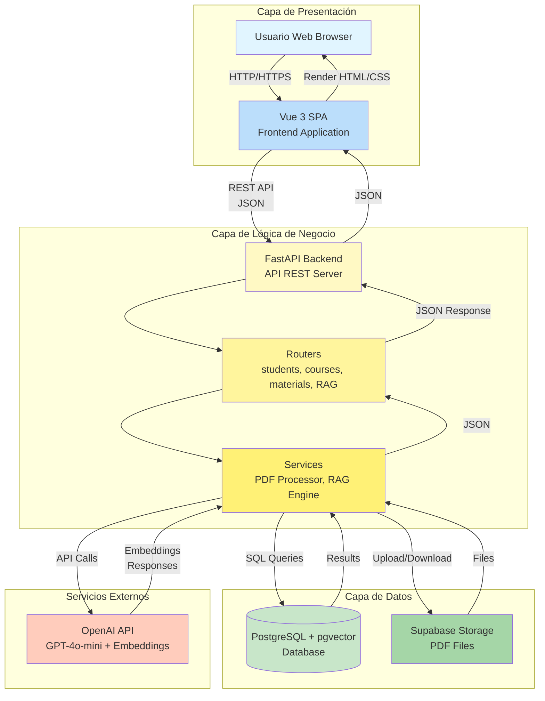

**Descripción del Diagrama:**

Este diagrama muestra la arquitectura general del sistema dividida en 3 capas principales más servicios externos:

1. **Capa de Presentación (Frontend):**
   - Usuario interactúa con navegador web.
   - Vue 3 SPA maneja toda la interfaz de usuario.
   - Comunicación vía HTTP/HTTPS.

2. **Capa de Lógica de Negocio (Backend):**
   - FastAPI servidor procesa todas las peticiones.
   - Routers manejan endpoints específicos.
   - Services contienen lógica compleja (procesamiento de PDFs, RAG).

3. **Capa de Datos:**
   - PostgreSQL almacena datos estructurados y vectores.
   - Supabase Storage almacena archivos PDF.

4. **Servicios Externos:**
   - OpenAI API proporciona capacidades de IA.

---

### 2.2 Diagrama de Arquitectura Detallada por Componentes

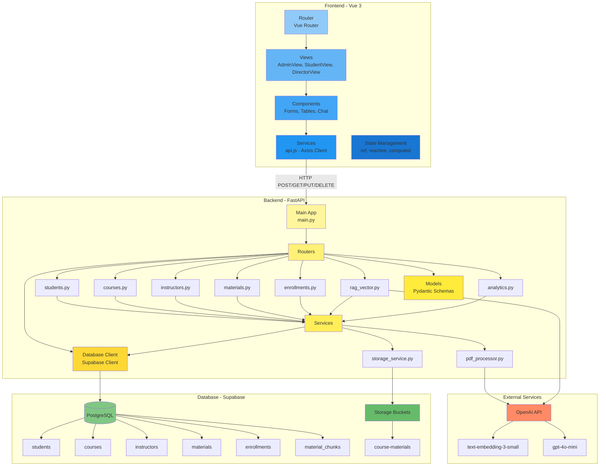

**Descripción de Componentes:**

**Frontend (Vue 3):**
- **Router**: Gestiona navegación entre vistas (`/admin`, `/student`, `/director`).
- **Views**: Vistas principales para cada rol.
- **Components**: Componentes reutilizables (formularios, tablas, chat).
- **Services**: Capa de comunicación con backend (Axios).
- **State Management**: Gestión reactiva de estado con Composition API.

**Backend (FastAPI):**
- **Main App**: Punto de entrada, configuración CORS, lifespan events.
- **Routers**: 7 routers modulares, uno por entidad/funcionalidad.
- **Services**: Lógica compleja separada (procesamiento PDFs, RAG).
- **Models**: Validación de datos con Pydantic.
- **Database Client**: Singleton para conexión a Supabase.

**Database (Supabase):**
- **PostgreSQL**: 6 tablas relacionales + extensión pgvector.
- **Storage**: Bucket para almacenar PDFs.

**External Services:**
- **OpenAI API**: 2 modelos (embeddings + chat).

---

## 3. Flujo de Datos por Módulo

### 3.1 Flujo CRUD Básico (Ejemplo: Crear Estudiante)

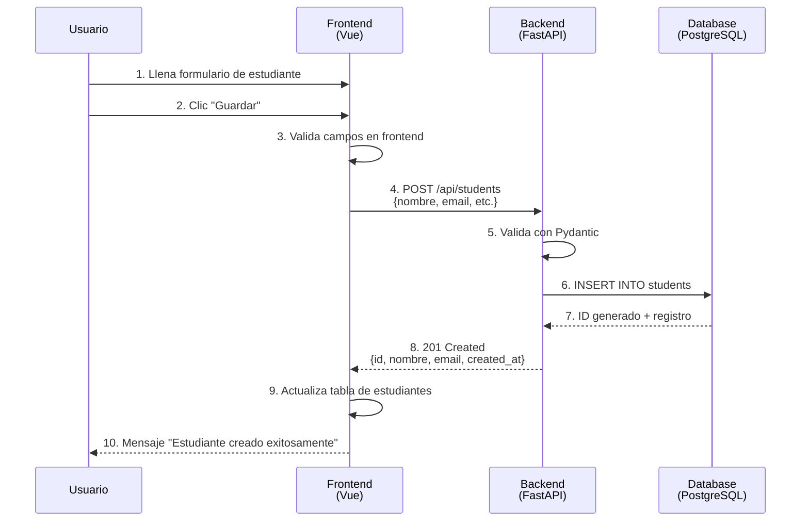

**Descripción del Flujo:**

1. **Usuario** llena formulario con datos del estudiante.
2. **Usuario** envía formulario haciendo clic en "Guardar".
3. **Frontend** realiza validación básica (campos requeridos, formato email).
4. **Frontend** envía petición HTTP POST a backend con JSON.
5. **Backend** valida datos usando modelo Pydantic `StudentCreate`.
6. **Backend** ejecuta query SQL `INSERT` en tabla `students`.
7. **Database** retorna ID generado y datos insertados.
8. **Backend** responde con código 201 (Created) y JSON del estudiante.
9. **Frontend** actualiza lista de estudiantes en interfaz.
10. **Frontend** muestra mensaje de éxito al usuario.

---

### 3.2 Flujo Completo de Procesamiento de Material (PDF)

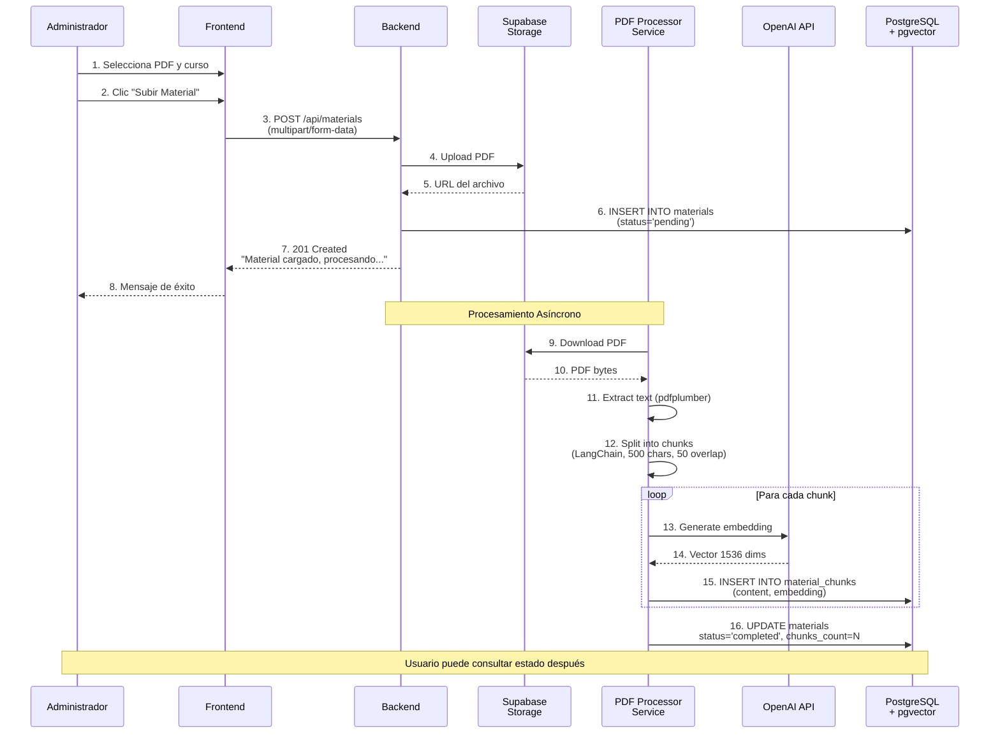

**Descripción del Flujo:**

**Fase 1: Carga del PDF (Síncrona)**
1. Administrador selecciona archivo PDF y curso destino.
2. Administrador inicia carga haciendo clic en "Subir Material".
3. Frontend envía petición multipart/form-data a backend.
4. Backend sube PDF a Supabase Storage.
5. Storage retorna URL del archivo almacenado.
6. Backend inserta registro en tabla `materials` con `status='pending'`.
7. Backend responde inmediatamente al frontend (no espera procesamiento).
8. Usuario recibe confirmación de carga exitosa.

**Fase 2: Procesamiento (Asíncrona en segundo plano)**
9. PDF Processor descarga archivo desde Storage.
10. Storage retorna bytes del PDF.
11. Processor extrae texto usando pdfplumber.
12. Processor divide texto en chunks de ~500 caracteres con overlap de 50.
13-14. Para cada chunk, genera embedding usando OpenAI (vector de 1536 dimensiones).
15. Inserta chunk con su embedding en tabla `material_chunks`.
16. Actualiza material con `status='completed'` y contador de chunks.

**Resultado:** PDF procesado y listo para búsqueda vectorial en chat.

---

### 3.3 Flujo Completo del Sistema RAG (Chat Inteligente)

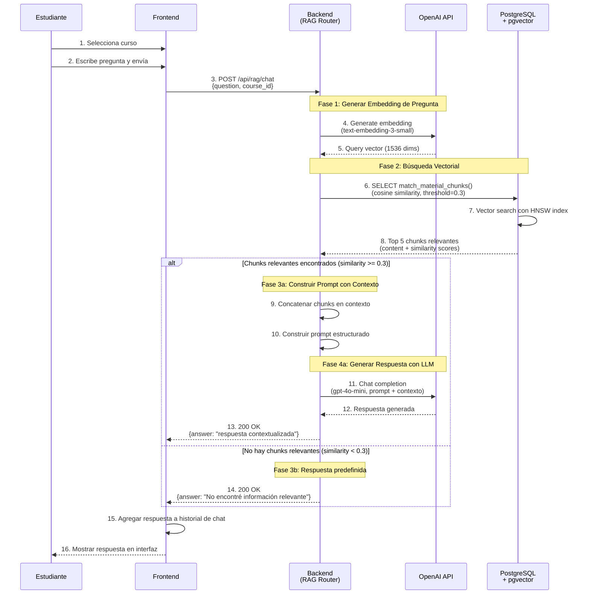

**Descripción Detallada del Flujo RAG:**

**Paso 1-3: Iniciación**
- Estudiante selecciona curso para contextualizar chat.
- Estudiante escribe pregunta en lenguaje natural.
- Frontend envía pregunta y course_id a endpoint RAG.

**Fase 1: Vectorización de Pregunta (Pasos 4-5)**
- Backend envía pregunta a OpenAI para generar embedding.
- OpenAI retorna vector de 1536 dimensiones que representa semánticamente la pregunta.
- **Modelo usado:** `text-embedding-3-small`
- **Costo:** ~$0.02 por 1M tokens

**Fase 2: Búsqueda Vectorial (Pasos 6-8)**
- Backend llama función SQL `match_material_chunks` con:
  - Query embedding (vector de pregunta)
  - Course ID (para filtrar solo chunks del curso)
  - Threshold de similitud (0.3)
  - Número de resultados (5)
- PostgreSQL usa índice HNSW para búsqueda rápida.
- Calcula similitud coseno entre query vector y embeddings de chunks.
- Retorna top 5 chunks con similarity >= 0.3.
- **Performance:** <100ms con índice HNSW.

**Fase 3a: Construcción de Prompt (Pasos 9-10)** [Si hay chunks relevantes]
- Backend concatena contenido de los 5 chunks.
- Construye prompt estructurado:
  ```
  Eres un asistente educativo. Responde basándote en el siguiente contexto del curso [Nombre]:
  
  Contexto:
  [Chunk 1 content]
  [Chunk 2 content]
  [Chunk 3 content]
  [Chunk 4 content]
  [Chunk 5 content]
  
  Pregunta del estudiante:
  [Pregunta original]
  
  Responde en español de manera clara y educativa. Si el contexto no contiene información suficiente, indícalo.
  ```

**Fase 4a: Generación de Respuesta (Pasos 11-12)** [Si hay chunks relevantes]
- Backend envía prompt a OpenAI GPT-4o-mini.
- **Parámetros:**
  - `temperature=0.3` (respuestas consistentes, menos creativas)
  - `max_tokens=500` (respuestas concisas)
- GPT-4 genera respuesta basada en contexto proporcionado.
- **Costo:** ~$0.15 por 1M tokens input, ~$0.60 por 1M tokens output.

**Fase 3b/4b: Sin Información (Paso 14)** [Si no hay chunks relevantes]
- Backend detecta que no hay chunks con similarity >= 0.3.
- Retorna mensaje predefinido sin llamar a GPT-4 (ahorro de costos).
- Mensaje: "No encontré información relevante sobre tu pregunta en el material del curso."

**Pasos 15-16: Presentación**
- Frontend agrega respuesta a historial de conversación.
- Frontend renderiza respuesta en interfaz de chat.
- Estudiante puede continuar haciendo preguntas.

**Optimizaciones Implementadas:**
- ✅ Índice HNSW para búsquedas vectoriales rápidas.
- ✅ Threshold de similitud para evitar respuestas irrelevantes.
- ✅ No se llama a GPT-4 si no hay contexto relevante.
- ✅ Temperature baja para respuestas consistentes.

---

## 4. Arquitectura de Base de Datos

### 4.1 Diagrama Entidad-Relación (ER)

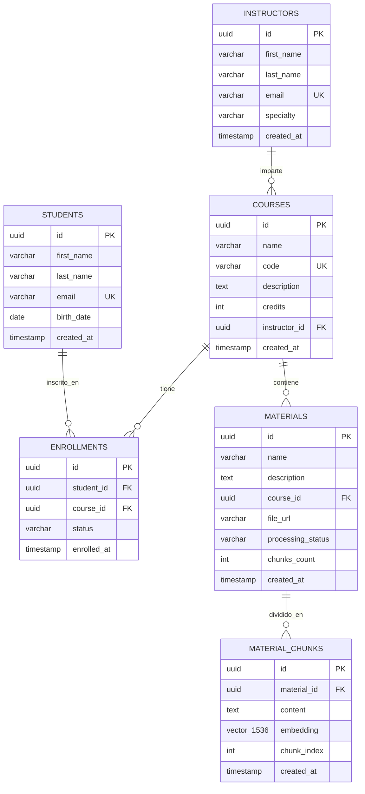

**Descripción de Relaciones:**

1. **STUDENTS → ENROLLMENTS (1:N)**
   - Un estudiante puede tener múltiples inscripciones.
   - Una inscripción pertenece a un solo estudiante.
   - **Eliminación:** ON DELETE CASCADE (eliminar estudiante elimina sus inscripciones).

2. **COURSES → ENROLLMENTS (1:N)**
   - Un curso puede tener múltiples inscripciones.
   - Una inscripción pertenece a un solo curso.
   - **Eliminación:** ON DELETE CASCADE.

3. **INSTRUCTORS → COURSES (1:N)**
   - Un instructor puede impartir múltiples cursos.
   - Un curso tiene un solo instructor asignado.
   - **Eliminación:** ON DELETE RESTRICT (no permitir eliminar instructor con cursos).

4. **COURSES → MATERIALS (1:N)**
   - Un curso puede tener múltiples materiales (PDFs).
   - Un material pertenece a un solo curso.
   - **Eliminación:** ON DELETE CASCADE.

5. **MATERIALS → MATERIAL_CHUNKS (1:N)**
   - Un material se divide en múltiples chunks.
   - Un chunk pertenece a un solo material.
   - **Eliminación:** ON DELETE CASCADE (eliminar material elimina sus chunks).

---

### 4.2 Diagrama de Almacenamiento Vectorial

```mermaid
graph LR
    subgraph "Material Original"
        A[PDF Document<br/>50 páginas]
    end
    
    subgraph "Procesamiento"
        B[Text Extraction<br/>pdfplumber]
        C[Text Chunking<br/>LangChain<br/>500 chars, 50 overlap]
    end
    
    subgraph "Vectorización"
        D[Chunk 1<br/>"El cableado estructurado..."]
        E[Chunk 2<br/>"Los estándares TIA/EIA..."]
        F[Chunk 3<br/>"La categoría 6A soporta..."]
        G[...]
        H[Chunk N<br/>"..."]
    end
    
    subgraph "OpenAI API"
        I[text-embedding-3-small]
    end
    
    subgraph "PostgreSQL + pgvector"
        J[(material_chunks table)]
        K[id: uuid<br/>material_id: uuid<br/>content: text<br/>embedding: vector-1536-<br/>chunk_index: int]
        L[HNSW Index<br/>m=16, ef_construction=64]
    end
    
    A --> B
    B --> C
    C --> D & E & F & G & H
    D & E & F & G & H --> I
    I -->|Vector 1536 dims| J
    J --> K
    K --> L
    
    style A fill:#ffccbc
    style B fill:#fff9c4
    style C fill:#fff59d
    style D fill:#c5e1a5
    style E fill:#c5e1a5
    style F fill:#c5e1a5
    style G fill:#c5e1a5
    style H fill:#c5e1a5
    style I fill:#ff8a65
    style J fill:#81c784
    style K fill:#66bb6a
    style L fill:#4caf50
```

**Descripción del Flujo de Vectorización:**

1. **PDF Original:** Documento de 50 páginas con contenido educativo.

2. **Text Extraction:** pdfplumber extrae texto completo del PDF.

3. **Text Chunking:** LangChain divide texto en fragmentos de ~500 caracteres con overlap de 50.

4. **Chunks Individuales:** Se generan N chunks (ejemplo: 51 chunks para PDF típico).

5. **OpenAI Embeddings:** Cada chunk se envía a OpenAI para generar su embedding (vector de 1536 dimensiones).

6. **Almacenamiento en PostgreSQL:**
   - Cada chunk se guarda en tabla `material_chunks`.
   - Incluye: contenido original (text) + embedding (vector).

7. **Índice HNSW:** Se crea índice especializado para búsquedas vectoriales rápidas.

**Ventajas del Almacenamiento Vectorial:**
- ✅ Búsqueda semántica (por significado, no solo keywords).
- ✅ Búsquedas muy rápidas con índice HNSW (<100ms).
- ✅ Escalable hasta 100K+ chunks sin degradación.

---

## 5. Arquitectura de Seguridad

### 5.1 Diagrama de Flujo de Seguridad

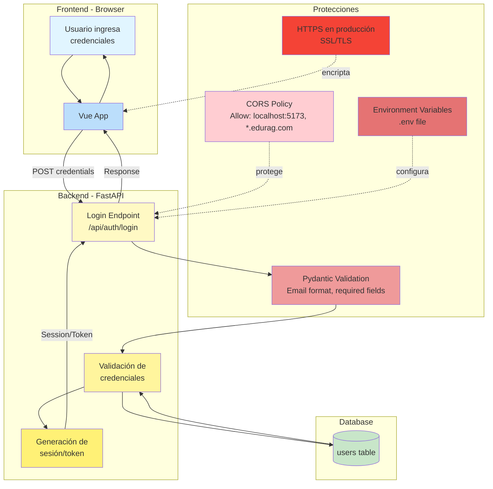

**Capas de Seguridad Implementadas:**

1. **CORS (Cross-Origin Resource Sharing):**
   - Configurado en backend para permitir solo orígenes específicos.
   - Desarrollo: `localhost:5173`, `localhost:8000`.
   - Producción: Solo dominio oficial del sistema.

2. **Validación de Datos (Pydantic):**
   - Todos los inputs validados en backend.
   - Formatos de email, tipos de datos, rangos.
   - Previene inyecciones SQL y datos malformados.

3. **Variables de Entorno:**
   - Credenciales sensibles nunca en código fuente.
   - Archivo `.env` para desarrollo (no en Git).
   - Variables de entorno en producción (Render/Railway).

4. **HTTPS/TLS en Producción:**
   - Todo el tráfico encriptado.
   - Certificados SSL de Let's Encrypt (gratis).
   - Previene man-in-the-middle attacks.

5. **Supabase Security:**
   - Row Level Security (RLS) si se configura.
   - API Keys con permisos limitados.
   - Conexiones encriptadas a base de datos.

---

## 6. Arquitectura de Despliegue

### 6.1 Diagrama de Despliegue en Producción

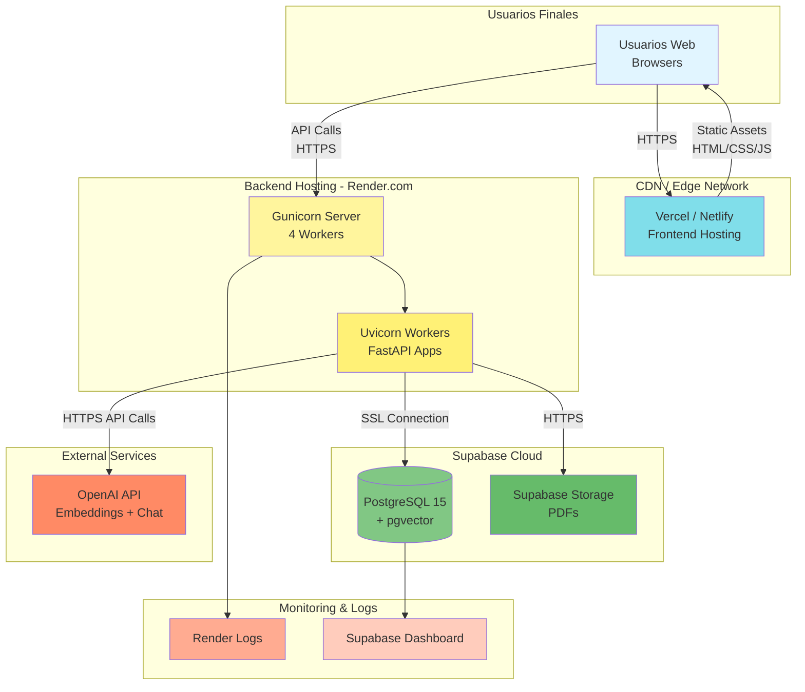

**Descripción del Despliegue:**

**Frontend:**
- **Hosting:** Vercel o Netlify (edge network global).
- **Build:** `npm run build` genera assets estáticos.
- **Deploy:** Automático desde Git push.
- **CDN:** Assets servidos desde edge locations cercanos al usuario.
- **HTTPS:** Certificado SSL automático.

**Backend:**
- **Hosting:** Render.com (containers en cloud).
- **Server:** Gunicorn con 4 workers.
- **Workers:** Uvicorn workers ejecutando FastAPI.
- **Health Checks:** Endpoint `/` para monitoring.
- **Logs:** Centralizados en Render dashboard.

**Base de Datos:**
- **Hosting:** Supabase Cloud (PostgreSQL managed).
- **Backups:** Automáticos diarios.
- **Conexiones:** Connection pooling automático.
- **Seguridad:** Conexiones SSL/TLS.

**Storage:**
- **Hosting:** Supabase Storage (S3-compatible).
- **Acceso:** URLs firmadas con expiración.
- **Bucket:** `course-materials` para PDFs.

**Servicios Externos:**
- **OpenAI:** Llamadas HTTPS a api.openai.com.
- **Rate Limiting:** Manejo de límites de API.

---

## 7. Patrones Arquitectónicos Aplicados

### 7.1 Patrón de Capas (Layered Architecture)

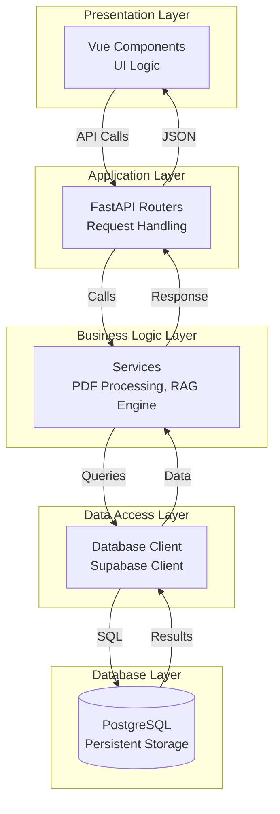

**Beneficios del Patrón de Capas:**
- ✅ **Separación de Responsabilidades:** Cada capa tiene un propósito claro.
- ✅ **Mantenibilidad:** Cambios en una capa no afectan otras.
- ✅ **Testabilidad:** Cada capa se puede probar independientemente.
- ✅ **Escalabilidad:** Capas pueden escalar horizontalmente.

---

### 7.2 Patrón Cliente-Servidor

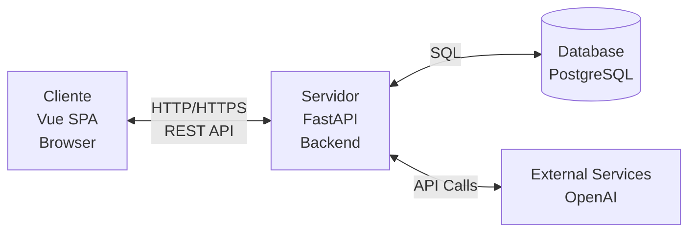

**Características:**
- **Cliente:** Frontend Vue 3 ejecutándose en browser del usuario.
- **Servidor:** Backend FastAPI en servidor remoto.
- **Comunicación:** HTTP/HTTPS con JSON (REST API).
- **Separación:** Cliente y servidor son aplicaciones independientes.

---

### 7.3 Patrón Repository (Implícito)

Aunque no está explícitamente implementado como clases Repository, el patrón se sigue implícitamente:

```python
# Abstracción de acceso a datos centralizada en routers
@router.get("/students")
async def get_students():
    response = supabase.table('students').select("*").execute()
    return response.data

# En lugar de queries dispersas en todo el código
```

---

## 8. Escalabilidad de la Arquitectura

### 8.1 Estrategias de Escalabilidad

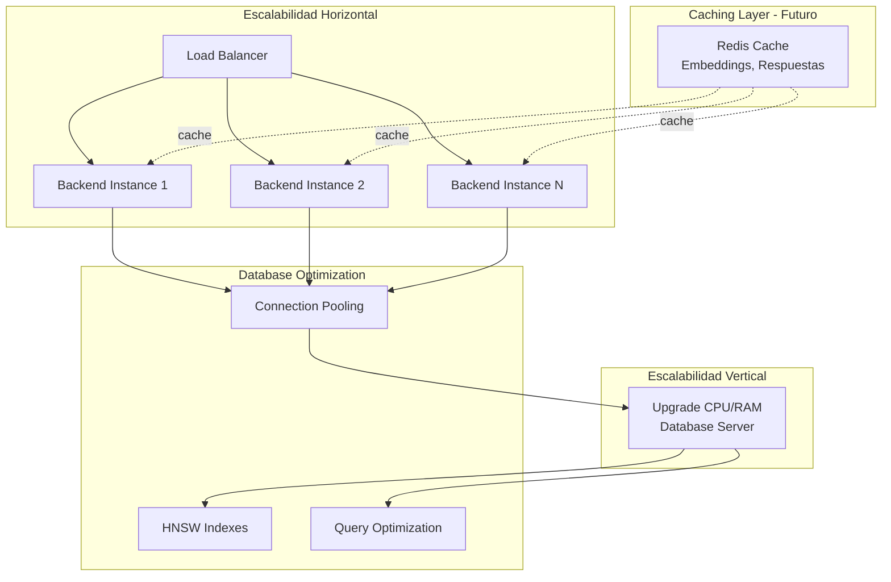

**Implementado Actualmente:**
- ✅ **Connection Pooling:** Supabase gestiona pool de conexiones.
- ✅ **HNSW Indexes:** Búsquedas vectoriales optimizadas.
- ✅ **Async/Await:** FastAPI soporta miles de requests concurrentes.

**Futuras Mejoras:**
- 🔮 **Redis Cache:** Cachear embeddings y respuestas frecuentes.
- 🔮 **Horizontal Scaling:** Múltiples instancias de backend con load balancer.
- 🔮 **Database Replication:** Read replicas para queries pesadas.

---

## 9. Resiliencia y Tolerancia a Fallos

### 9.1 Puntos de Fallo y Mitigaciones

| Componente | Punto de Fallo Potencial | Mitigación Implementada |
|------------|--------------------------|-------------------------|
| **Frontend** | Browser crash | Estado en memoria se pierde (aceptable para MVP) |
| **Backend** | Server crash | Restart automático en Render, health checks |
| **Database** | Connection loss | Retry logic en cliente Supabase |
| **OpenAI API** | Rate limit exceeded | Retry con exponential backoff |
| **OpenAI API** | Service unavailable | Error handling, mensaje al usuario |
| **Storage** | File upload fails | Error handling, retry mechanism |

**Estrategias de Resiliencia:**
- ✅ **Try-Catch:** Todos los endpoints tienen manejo de excepciones.
- ✅ **Health Checks:** Endpoint `/` retorna status del servidor.
- ✅ **Logging:** Errores registrados para debugging.
- ✅ **Graceful Degradation:** Sistema funciona parcialmente si OpenAI falla.

---

## 10. Conclusiones de Arquitectura

### 10.1 Fortalezas de la Arquitectura

✅ **Modular y Mantenible:**
- Separación clara de capas y responsabilidades.
- Fácil agregar nuevas funcionalidades sin afectar existentes.

✅ **Escalable:**
- Arquitectura preparada para crecimiento horizontal.
- Índices optimizados para grandes volúmenes de datos.

✅ **Moderna:**
- Uso de tecnologías actuales (FastAPI async, Vue 3, pgvector).
- Siguiendo best practices de la industria.

✅ **Bien Documentada:**
- Diagramas claros de arquitectura.
- Flujos documentados paso a paso.

### 10.2 Consideraciones Futuras

🔮 **Microservicios (Opcional):**
- Separar procesamiento de PDFs en servicio independiente.
- Motor RAG como microservicio.

🔮 **Message Queue:**
- Usar RabbitMQ o Kafka para procesamiento asíncrono de PDFs.
- Mejor manejo de workloads pesados.

🔮 **Containerización:**
- Dockerizar backend y frontend.
- Facilitar despliegue y consistencia de entornos.

---

**Documento de Diagrama de Arquitectura - EduRAG**  
**Análisis de Sistemas II**  
**Octubre 2025**  
**Estado: Arquitectura Completa y Documentada** ✅
