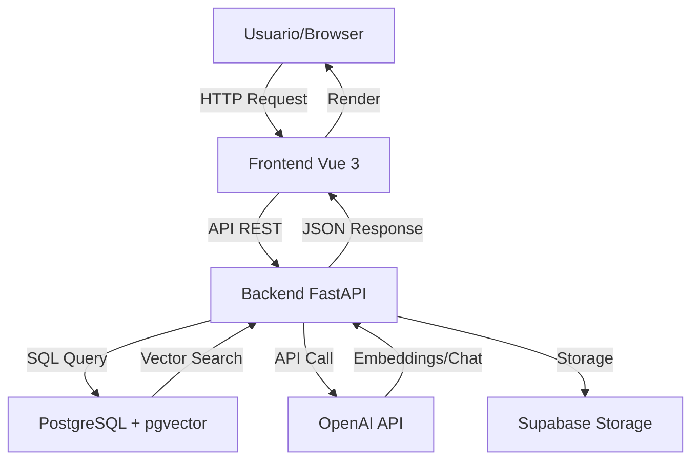

# Elementos Necesarios, Herramientas y Técnicas - Proyecto EduRAG

## Información del Documento

**Curso:** Análisis de Sistemas II  
**Proyecto:** EduRAG - Sistema de Gestión Educativa con IA  
**Tipo de Documento:** Recursos, Herramientas y Técnicas Utilizadas  
**Fecha:** Octubre 2025

---

## 1. Introducción

Este documento detalla todos los elementos necesarios para el desarrollo del proyecto EduRAG, incluyendo herramientas de software, técnicas de desarrollo, metodologías de diseño, recursos de hardware, y servicios externos utilizados. Cada sección incluye justificación de la elección y alternativas consideradas.

---

## 2. Herramientas de Desarrollo

### 2.1 Entornos de Desarrollo Integrados (IDEs)

#### Visual Studio Code

**Descripción:**  
Editor de código fuente ligero pero potente desarrollado por Microsoft.

**Uso en el Proyecto:**
- IDE principal para todo el equipo (backend, frontend, documentación).
- Edición de Python, JavaScript/Vue, Markdown, SQL.

**Extensiones Utilizadas:**

**Para Backend (Python):**
- **Python** (Microsoft): IntelliSense, linting, debugging.
- **Pylance**: Language server rápido para Python.
- **autopep8**: Formateo automático según PEP 8.
- **Python Docstring Generator**: Generación de docstrings.

**Para Frontend (Vue/JavaScript):**
- **Volar**: Soporte oficial para Vue 3 con TypeScript.
- **ESLint**: Linting de JavaScript/Vue.
- **Prettier**: Formateo automático de código.
- **Tailwind CSS IntelliSense**: Autocompletado de clases Tailwind.

**Utilidades Generales:**
- **GitLens**: Visualización avanzada de Git.
- **REST Client**: Testing de APIs sin salir del editor.
- **Markdown All in One**: Edición de documentación.

**Alternativas Consideradas:**
- **PyCharm** (más pesado, enfocado solo en Python).
- **WebStorm** (de pago, enfocado en web).
- **Sublime Text** (menos features que VSCode).

**Justificación de Elección:**
- ✅ Gratuito y open-source.
- ✅ Soporte excelente para Python y Vue.
- ✅ Ecosistema de extensiones muy rico.
- ✅ Ligero y rápido comparado con IDEs pesados.
- ✅ Todo el equipo puede usar el mismo editor.

---

### 2.2 Control de Versiones

#### Git

**Descripción:**  
Sistema de control de versiones distribuido, estándar de la industria.

**Uso en el Proyecto:**
- Versionamiento de código fuente (backend y frontend).
- Branches para features (opcional).
- Commits con mensajes descriptivos.
- History completo del proyecto.

**Comandos Principales Utilizados:**
```bash
git init                    # Inicializar repositorio
git add .                   # Agregar cambios
git commit -m "mensaje"     # Confirmar cambios
git push origin main        # Subir a repositorio remoto
git pull                    # Actualizar desde remoto
git branch feature-name     # Crear branch
git merge feature-name      # Integrar branch
```

**Alternativas Consideradas:**
- **SVN** (centralizado, menos usado actualmente).
- **Mercurial** (similar a Git, menos popular).

**Justificación de Elección:**
- ✅ Estándar de la industria (99% de empresas lo usan).
- ✅ Distribuido (cada desarrollador tiene copia completa).
- ✅ Branches ligeros y rápidos.
- ✅ Integración perfecta con GitHub.

---

#### GitHub

**Descripción:**  
Plataforma de hosting para repositorios Git con features colaborativas.

**Uso en el Proyecto:**
- Repositorio remoto central del código.
- Colaboración entre miembros del equipo.
- Issues para tracking de bugs y features.
- Pull Requests para code reviews (opcional).
- README.md visible en página principal.

**Features Utilizadas:**
- **Repositorio Privado/Público**: Código accesible.
- **README.md**: Documentación principal visible.
- **Commits History**: Trazabilidad de cambios.
- **Clone/Fork**: Facilita colaboración.

**Alternativas Consideradas:**
- **GitLab** (similar, más features DevOps).
- **Bitbucket** (enfocado en equipos Atlassian).
- **Self-hosted Git** (requiere infraestructura).

**Justificación de Elección:**
- ✅ Más popular (comunidad grande).
- ✅ Interfaz intuitiva.
- ✅ Gratis para proyectos públicos/privados (plan free).
- ✅ Excelente para proyectos académicos.

---

### 2.3 Gestión de Proyectos

#### Trello / Jira

**Descripción:**  
Herramientas de gestión de proyectos basadas en tableros Kanban/Scrum.

**Uso en el Proyecto:**
- Product Backlog con user stories.
- Sprint Backlog con tareas del sprint actual.
- Board con columnas: To Do, In Progress, In Review, Done.
- Asignación de tareas a desarrolladores.
- Estimación en story points.

**Estructura del Tablero:**
```
┌─────────────────────────────────────────────────────────┐
│  PRODUCT BACKLOG  │  TO DO  │  DOING  │  REVIEW  │ DONE │
├─────────────────────────────────────────────────────────┤
│ [US-45] Sistema   │ [US-12] │ [US-08] │ [US-05]  │[US-01]│
│ de notificaciones │Dashboard│ Chat UI │ RAG API  │CRUD   │
│ Priority: Low     │Priority:│(Dev 3)  │(Dev 1)   │✓     │
│                   │ Medium  │ 8 SP    │          │       │
├─────────────────────────────────────────────────────────┤
│ [US-46] Reportes  │ [US-13] │ [US-09] │          │[US-02]│
│ avanzados         │Métricas │ RAG     │          │CRUD   │
│ Priority: Low     │(Dir)    │Backend  │          │✓     │
│                   │         │(Dev 2)  │          │       │
└─────────────────────────────────────────────────────────┘
```

**Alternativas Consideradas:**
- **Asana** (más enfocado en tareas generales).
- **Monday.com** (más visual, de pago).
- **Excel/Sheets** (manual, menos features).

**Justificación de Elección:**
- ✅ Trello: Gratis, simple, perfecto para Scrum básico.
- ✅ Jira: Más robusto para equipos grandes (opcional).
- ✅ Integración con otras herramientas.
- ✅ Accesible desde cualquier dispositivo.

---

### 2.4 Comunicación

#### WhatsApp / Discord

**Descripción:**  
Aplicaciones de mensajería para comunicación instantánea del equipo.

**Uso en el Proyecto:**
- Comunicación diaria informal.
- Notificaciones de bloqueos urgentes.
- Coordinación rápida de daily standups.
- Compartir links y recursos.

**Alternativas Consideradas:**
- **Slack** (más profesional, mejor para equipos grandes).
- **Microsoft Teams** (integrado con Office 365).
- **Telegram** (similar a WhatsApp).

**Justificación de Elección:**
- ✅ Todo el equipo ya lo usa.
- ✅ Gratis y accesible en móviles.
- ✅ Mensajería instantánea eficiente.

---

#### Google Meet / Zoom

**Descripción:**  
Plataformas de videoconferencia para reuniones remotas.

**Uso en el Proyecto:**
- Daily Standups (15 min diarios).
- Sprint Planning (2 horas cada 2 semanas).
- Sprint Review (1.5 horas cada 2 semanas).
- Sprint Retrospective (1 hora cada 2 semanas).
- Pair Programming sessions.

**Alternativas Consideradas:**
- **Microsoft Teams** (más corporativo).
- **Discord** (más informal, bueno para audio).
- **Jitsi Meet** (open-source, menos estable).

**Justificación de Elección:**
- ✅ Gratis para reuniones de hasta 1 hora.
- ✅ Calidad de video/audio confiable.
- ✅ Grabación de reuniones (útil para retrospectivas).
- ✅ Compartir pantalla (esencial para pair programming).

---

### 2.5 Testing de APIs

#### Postman

**Descripción:**  
Plataforma para desarrollo y testing de APIs.

**Uso en el Proyecto:**
- Testing manual de endpoints durante desarrollo.
- Colecciones organizadas por módulo (students, courses, etc.).
- Variables de entorno (dev, prod).
- Documentación visual de APIs.

**Features Utilizadas:**
- **Collections**: Grupos de requests por módulo.
- **Environments**: Variables (base_url, tokens).
- **Tests**: Validaciones básicas de responses.
- **History**: Historial de requests ejecutados.

**Ejemplo de Colección:**
```
EduRAG API
├── Authentication
│   └── POST Login
├── Students
│   ├── POST Create Student
│   ├── GET List Students
│   ├── GET Get Student by ID
│   ├── PUT Update Student
│   └── DELETE Delete Student
├── Courses
│   ├── POST Create Course
│   └── GET List Courses
└── RAG
    └── POST Chat
```

**Alternativas Consideradas:**
- **Insomnia** (similar a Postman, más ligero).
- **curl** (línea de comandos, menos intuitivo).
- **Thunder Client** (extensión VSCode, más simple).

**Justificación de Elección:**
- ✅ Industry standard para testing de APIs.
- ✅ Interfaz gráfica intuitiva.
- ✅ Colecciones compartibles entre equipo.
- ✅ Gratis para uso básico.

---

## 3. Tecnologías de Desarrollo

### 3.1 Backend

#### Python 3.11+

**Descripción:**  
Lenguaje de programación de alto nivel, interpretado, multiparadigma.

**Uso en el Proyecto:**
- Lenguaje principal para backend.
- Procesamiento de PDFs.
- Integración con APIs de IA.
- Lógica de negocio.

**Características Utilizadas:**
- **Type Hints**: Anotaciones de tipos para claridad.
- **Async/Await**: Programación asíncrona con FastAPI.
- **List Comprehensions**: Código conciso.
- **Context Managers**: Gestión de recursos (with).

**Alternativas Consideradas:**
- **Node.js/JavaScript** (menos maduro para IA).
- **Java** (más verboso, menos ágil).
- **Go** (muy rápido pero menos librerías de IA).

**Justificación de Elección:**
- ✅ Ecosistema rico de librerías de IA/ML.
- ✅ Sintaxis clara y legible.
- ✅ FastAPI aprovecha async de Python moderno.
- ✅ Excellent para procesamiento de datos.

---

#### FastAPI

**Descripción:**  
Framework web moderno para construir APIs con Python, basado en type hints.

**Uso en el Proyecto:**
- Framework principal del backend.
- Definición de routers y endpoints.
- Validación automática con Pydantic.
- Documentación automática (Swagger UI).

**Features Clave:**
- **Async/Await**: Alto performance con I/O no bloqueante.
- **Type Hints**: Validación automática de datos.
- **Dependency Injection**: Gestión elegante de dependencias.
- **Automatic Docs**: Swagger UI generado automáticamente.

**Ejemplo de Código:**
```python
from fastapi import FastAPI, HTTPException
from pydantic import BaseModel

app = FastAPI()

class Student(BaseModel):
    name: str
    email: str
    age: int

@app.post("/students")
async def create_student(student: Student):
    # Validación automática con Pydantic
    # Async para operaciones I/O
    return {"id": 1, **student.dict()}
```

**Alternativas Consideradas:**
- **Flask** (más simple pero menos features).
- **Django** (muy completo pero más pesado).
- **Express.js** (Node.js, diferente ecosistema).

**Justificación de Elección:**
- ✅ Performance comparable a Node.js/Go.
- ✅ Validación automática (menos código boilerplate).
- ✅ Documentación automática (ahorra tiempo).
- ✅ Moderno y diseñado para APIs.

---

#### Pydantic

**Descripción:**  
Librería de validación de datos usando type hints de Python.

**Uso en el Proyecto:**
- Modelos de datos para validación.
- Request/Response schemas.
- Conversión automática de tipos.
- Validación de campos (email, required, etc.).

**Ejemplo:**
```python
from pydantic import BaseModel, EmailStr, Field

class StudentCreate(BaseModel):
    first_name: str = Field(..., max_length=100)
    last_name: str = Field(..., max_length=100)
    email: EmailStr  # Validación automática de email
    birth_date: date
```

**Ventajas:**
- ✅ Validación en tiempo de ejecución.
- ✅ Errores claros cuando datos son inválidos.
- ✅ Integración perfecta con FastAPI.

---

### 3.2 Frontend

#### Vue.js 3.5

**Descripción:**  
Framework progresivo de JavaScript para construir interfaces de usuario.

**Uso en el Proyecto:**
- Framework principal del frontend.
- Single Page Application (SPA).
- Componentes reutilizables.
- Reactive state management.

**Features Utilizadas:**
- **Composition API**: Lógica reactiva más organizada.
- **Reactive State**: `ref()`, `reactive()`, `computed()`.
- **Lifecycle Hooks**: `onMounted()`, `watch()`.
- **Components**: Modularización de UI.

**Ejemplo de Componente:**
```vue
<script setup>
import { ref, onMounted } from 'vue'
import api from '@/services/api'

const students = ref([])
const loading = ref(false)

onMounted(async () => {
  loading.value = true
  const response = await api.get('/students')
  students.value = response.data
  loading.value = false
})
</script>

<template>
  <div v-if="loading">Cargando...</div>
  <div v-else>
    <div v-for="student in students" :key="student.id">
      {{ student.name }}
    </div>
  </div>
</template>
```

**Alternativas Consideradas:**
- **React** (más popular pero más complejo).
- **Angular** (más pesado, curva de aprendizaje).
- **Svelte** (muy moderno pero menos maduro).

**Justificación de Elección:**
- ✅ Curva de aprendizaje suave.
- ✅ Composition API moderna y poderosa.
- ✅ Excelente documentación en español.
- ✅ Performance excepcional.
- ✅ Menos boilerplate que React.

---

#### Vite 5.0

**Descripción:**  
Build tool de próxima generación para proyectos web frontend.

**Uso en el Proyecto:**
- Servidor de desarrollo con Hot Module Replacement (HMR).
- Build de producción optimizado.
- Importación de componentes Vue.
- Bundle de assets.

**Ventajas sobre Webpack:**
- ⚡ Inicio de servidor instantáneo (cold start < 1s).
- ⚡ HMR ultra rápido (cambios visibles en milisegundos).
- ⚡ Build de producción optimizado con Rollup.

**Alternativas Consideradas:**
- **Webpack** (más lento, más complejo).
- **Parcel** (más automático pero menos control).
- **Create React App** (solo para React).

**Justificación de Elección:**
- ✅ Velocidad de desarrollo excepcional.
- ✅ Configuración mínima necesaria.
- ✅ Recomendado oficialmente por Vue 3.
- ✅ Soporte para TypeScript out-of-the-box.

---

#### Tailwind CSS 3

**Descripción:**  
Framework CSS utility-first para diseño rápido de interfaces.

**Uso en el Proyecto:**
- Estilos de todos los componentes.
- Diseño responsivo.
- Consistencia visual.
- Theming (colores, espaciado).

**Ejemplo de Uso:**
```html
<button class="bg-blue-600 hover:bg-blue-700 text-white font-bold py-2 px-4 rounded">
  Crear Estudiante
</button>

<div class="grid grid-cols-1 md:grid-cols-2 lg:grid-cols-3 gap-4">
  <!-- Responsive grid -->
</div>
```

**Alternativas Consideradas:**
- **Bootstrap** (más opinado, componentes pre-diseñados).
- **Material UI** (diseño Material, más pesado).
- **CSS puro** (más tiempo, menos consistencia).

**Justificación de Elección:**
- ✅ Desarrollo muy rápido (clases utilitarias).
- ✅ Diseño responsivo fácil (breakpoints integrados).
- ✅ Bundle pequeño en producción (PurgeCSS).
- ✅ Customizable completamente.
- ✅ Comunidad grande y activa.

---

#### Axios

**Descripción:**  
Cliente HTTP basado en promesas para JavaScript.

**Uso en el Proyecto:**
- Comunicación con backend (API REST).
- Interceptors para manejo global de errores.
- Configuración centralizada (base URL).

**Ejemplo:**
```javascript
import axios from 'axios'

const apiClient = axios.create({
  baseURL: 'http://localhost:8000/api',
  headers: {
    'Content-Type': 'application/json'
  }
})

// Interceptor para manejo de errores
apiClient.interceptors.response.use(
  response => response,
  error => {
    console.error('API Error:', error)
    return Promise.reject(error)
  }
)

export default apiClient
```

**Alternativas Consideradas:**
- **Fetch API** (nativo, menos features).
- **jQuery Ajax** (legacy, pesado).
- **ky** (moderno, menos popular).

**Justificación de Elección:**
- ✅ Industry standard para HTTP en frontend.
- ✅ Interceptors poderosos.
- ✅ Sintaxis limpia con async/await.
- ✅ Manejo automático de JSON.

---

### 3.3 Base de Datos

#### PostgreSQL 15

**Descripción:**  
Sistema de gestión de bases de datos relacional open-source, uno de los más avanzados.

**Uso en el Proyecto:**
- Base de datos principal del sistema.
- Almacenamiento de todas las entidades (students, courses, etc.).
- Almacenamiento de embeddings vectoriales (con pgvector).

**Features Utilizadas:**
- **ACID Compliance**: Transacciones confiables.
- **Foreign Keys**: Integridad referencial.
- **CHECK Constraints**: Validaciones a nivel de DB.
- **Indexes**: B-tree para columnas comunes, HNSW para vectores.
- **JSON Support**: Columnas JSONB (si necesario).

**Alternativas Consideradas:**
- **MySQL** (menos features avanzadas).
- **MongoDB** (NoSQL, no ideal para datos relacionales).
- **SQLite** (muy simple, no escalable).

**Justificación de Elección:**
- ✅ Soporte para extensiones (pgvector).
- ✅ Performance excelente para workloads complejos.
- ✅ Totalmente open-source y gratuito.
- ✅ Excelente para datos relacionales.

---

#### pgvector

**Descripción:**  
Extensión de PostgreSQL para almacenamiento y búsqueda de vectores (embeddings).

**Uso en el Proyecto:**
- Almacenamiento de embeddings de chunks de texto (1536 dimensiones).
- Búsqueda por similitud coseno.
- Índices HNSW para búsquedas rápidas.

**Operadores Utilizados:**
```sql
-- Similitud coseno (0 = idénticos, 2 = opuestos)
embedding <=> query_embedding

-- L2 distance
embedding <-> query_embedding

-- Inner product
embedding <#> query_embedding
```

**Ejemplo de Función:**
```sql
CREATE OR REPLACE FUNCTION match_material_chunks(
  query_embedding vector(1536),
  course_id_param uuid,
  match_threshold float,
  match_count int
)
RETURNS TABLE (
  id uuid,
  content text,
  similarity float
)
LANGUAGE plpgsql
AS $$
BEGIN
  RETURN QUERY
  SELECT
    mc.id,
    mc.content,
    1 - (mc.embedding <=> query_embedding) as similarity
  FROM material_chunks mc
  JOIN materials m ON m.id = mc.material_id
  WHERE m.course_id = course_id_param
    AND 1 - (mc.embedding <=> query_embedding) > match_threshold
  ORDER BY mc.embedding <=> query_embedding
  LIMIT match_count;
END;
$$;
```

**Alternativas Consideradas:**
- **Pinecone** (SaaS vectorial, de pago).
- **Weaviate** (open-source, más complejo).
- **FAISS** (librería, no DB integrada).
- **Qdrant** (especializado, requiere servidor separado).

**Justificación de Elección:**
- ✅ Integrado en PostgreSQL (una sola DB).
- ✅ Open-source y gratuito.
- ✅ HNSW index para búsquedas rápidas.
- ✅ Queries SQL familiares.
- ✅ Supabase tiene soporte nativo.

---

### 3.4 Inteligencia Artificial

#### OpenAI API

**Descripción:**  
Plataforma de APIs de inteligencia artificial de OpenAI (GPT-4, embeddings).

**Modelos Utilizados:**

**1. text-embedding-3-small**
- **Uso**: Generación de embeddings (vectores de 1536 dimensiones).
- **Input**: Texto de chunks (~500 caracteres).
- **Output**: Vector numérico de 1536 dimensiones.
- **Costo**: $0.02 por 1M tokens (~$2-5/mes para uso educativo).

**2. gpt-4o-mini**
- **Uso**: Generación de respuestas en chat.
- **Input**: Prompt con contexto + pregunta.
- **Output**: Respuesta en lenguaje natural.
- **Costo**: $0.15 por 1M tokens input, $0.60 por 1M tokens output.

**Ejemplo de Uso:**
```python
from openai import OpenAI

client = OpenAI(api_key=os.getenv("OPENAI_API_KEY"))

# Generar embedding
response = client.embeddings.create(
    model="text-embedding-3-small",
    input="Texto del chunk"
)
embedding = response.data[0].embedding  # 1536 dimensiones

# Generar respuesta de chat
response = client.chat.completions.create(
    model="gpt-4o-mini",
    messages=[
        {"role": "system", "content": "Eres un asistente educativo."},
        {"role": "user", "content": f"Contexto: {context}\n\nPregunta: {question}"}
    ],
    temperature=0.3
)
answer = response.choices[0].message.content
```

**Alternativas Consideradas:**
- **Ollama** (modelos locales, gratis pero menos potente).
- **Anthropic Claude** (similar a GPT, más caro).
- **Google PaLM** (menos accesible).
- **Hugging Face Models** (open-source, requiere hosting).

**Justificación de Elección:**
- ✅ Calidad de respuestas excepcional (GPT-4).
- ✅ API muy fácil de usar.
- ✅ Embeddings de alta calidad.
- ✅ Costo razonable para uso educativo.
- ✅ Documentación excelente.

---

#### LangChain

**Descripción:**  
Framework para desarrollar aplicaciones con Large Language Models (LLMs).

**Uso en el Proyecto:**
- **RecursiveCharacterTextSplitter**: División de PDFs en chunks.
- **Document Loaders**: Estructuras para manejar documentos.
- **Utilidades**: Helpers para trabajo con LLMs.

**Ejemplo de Chunking:**
```python
from langchain.text_splitter import RecursiveCharacterTextSplitter

text_splitter = RecursiveCharacterTextSplitter(
    chunk_size=500,           # Tamaño objetivo de chunk
    chunk_overlap=50,         # Overlap entre chunks
    length_function=len,      # Función para medir longitud
    separators=["\n\n", "\n", " ", ""]  # Separadores en orden de prioridad
)

chunks = text_splitter.split_text(pdf_text)
```

**Alternativas Consideradas:**
- **Implementación manual** (más control, más trabajo).
- **LlamaIndex** (similar, menos maduro).

**Justificación de Elección:**
- ✅ Industry standard para aplicaciones LLM.
- ✅ Chunking inteligente con overlaps.
- ✅ Muchas utilidades pre-construidas.
- ✅ Bien documentado y mantenido.

---

### 3.5 Servicios Cloud

#### Supabase

**Descripción:**  
Backend-as-a-Service open-source, alternativa a Firebase.

**Servicios Utilizados:**

**1. PostgreSQL Database**
- Hosting de base de datos PostgreSQL 15.
- Extensión pgvector habilitada.
- Backups automáticos.
- Connection pooling.

**2. Storage**
- Almacenamiento de archivos PDF.
- Bucket: `course-materials`.
- URLs firmadas para acceso seguro.

**3. Client Libraries**
- **supabase-py**: Cliente Python para backend.
- Queries simplificadas.
- Gestión de conexiones.

**Ejemplo de Uso:**
```python
from supabase import create_client

supabase = create_client(
    supabase_url=os.getenv("SUPABASE_URL"),
    supabase_key=os.getenv("SUPABASE_KEY")
)

# Query a base de datos
response = supabase.table('students').select("*").execute()

# Upload a storage
supabase.storage.from_('course-materials').upload(
    f'pdfs/{filename}',
    file_data
)
```

**Alternativas Consideradas:**
- **Firebase** (más caro, menos control sobre DB).
- **AWS RDS + S3** (más complejo de configurar).
- **Railway + S3** (requiere configuración manual).
- **Self-hosted PostgreSQL** (más trabajo operacional).

**Justificación de Elección:**
- ✅ PostgreSQL completo (no limitaciones de Firebase).
- ✅ Soporte nativo para pgvector.
- ✅ Free tier generoso (500 MB DB + Storage).
- ✅ APIs fáciles de usar.
- ✅ Dashboard intuitivo.

---

## 4. Herramientas de Diseño

### 4.1 Modelado de Datos

#### dbdiagram.io / draw.io

**Descripción:**  
Herramientas web para crear diagramas de bases de datos.

**Uso en el Proyecto:**
- Diseño del diagrama entidad-relación (ER).
- Documentación visual de esquema de DB.
- Exportación a imagen para documentación.

**Ejemplo de Sintaxis (dbdiagram.io):**
```
Table students {
  id uuid [pk]
  first_name varchar(100)
  last_name varchar(100)
  email varchar(255) [unique]
  birth_date date
  created_at timestamp
}

Table courses {
  id uuid [pk]
  name varchar(200)
  code varchar(20) [unique]
  instructor_id uuid [ref: > instructors.id]
}

Table enrollments {
  id uuid [pk]
  student_id uuid [ref: > students.id]
  course_id uuid [ref: > courses.id]
  status varchar(20)
  enrolled_at timestamp
}
```

**Alternativas Consideradas:**
- **Lucidchart** (más features, de pago).
- **MySQL Workbench** (específico para MySQL).
- **pgAdmin** (no optimizado para diagramas visuales).

**Justificación de Elección:**
- ✅ Gratis para uso básico.
- ✅ Sintaxis simple (dbdiagram.io).
- ✅ Exportación a múltiples formatos.
- ✅ Colaboración en tiempo real.

---

### 4.2 Modelado de Arquitectura

#### Draw.io / Mermaid

**Descripción:**  
Herramientas para crear diagramas de arquitectura y flujo.

**Uso en el Proyecto:**
- Diagrama de arquitectura general del sistema.
- Diagramas de flujo (RAG pipeline).
- Diagramas de secuencia (interacciones).

**Ejemplo de Diagrama Mermaid:**


**Alternativas Consideradas:**
- **Microsoft Visio** (de pago, Windows only).
- **PlantUML** (sintaxis más compleja).
- **ASCII art** (menos visual).

**Justificación de Elección:**
- ✅ Gratis y open-source.
- ✅ Mermaid se integra en Markdown.
- ✅ Draw.io muy intuitivo.
- ✅ Exportación a PNG/SVG.

---

### 4.3 Diseño de Interfaces (UI/UX)

#### Figma (Opcional)

**Descripción:**  
Herramienta de diseño de interfaces colaborativa basada en web.

**Uso en el Proyecto:**
- Mockups de vistas principales (opcional).
- Diseño de flujos de usuario.
- Prototipado rápido.

**Alternativas Consideradas:**
- **Adobe XD** (requiere instalación).
- **Sketch** (solo macOS, de pago).
- **Balsamiq** (wireframes simples).

**Justificación (si se usa):**
- ✅ Gratis para uso personal.
- ✅ Colaboración en tiempo real.
- ✅ Componentes reutilizables.

**Nota:** En este proyecto, el diseño se hizo principalmente directamente en código con Tailwind CSS debido a rapidez de desarrollo.

---

## 5. Técnicas de Desarrollo

### 5.1 Metodologías de Análisis

#### Análisis Orientado a Objetos

**Descripción:**  
Técnica para identificar objetos, clases y relaciones en el sistema.

**Aplicación en EduRAG:**
- Identificación de entidades principales: Student, Course, Instructor, Material, Enrollment.
- Definición de atributos por entidad.
- Relaciones entre entidades (1:N, N:M).

**Técnicas Utilizadas:**
- **Identificación de Sustantivos**: En descripción del problema.
- **CRC Cards**: Class-Responsibility-Collaboration.
- **Diagramas de Clase**: UML Class Diagrams.

---

#### Casos de Uso

**Descripción:**  
Técnica para capturar requerimientos funcionales desde perspectiva del usuario.

**Aplicación en EduRAG:**
- Identificación de actores: Administrador, Estudiante, Director, Sistema.
- Definición de casos de uso por actor.
- Flujos principales y alternativos.

**Ejemplo de Caso de Uso:**
```
Caso de Uso: Inscribir Estudiante a Curso
Actor Principal: Administrador
Precondiciones: 
  - Estudiante existe en sistema
  - Curso existe en sistema
Flujo Principal:
  1. Administrador selecciona "Nueva Inscripción"
  2. Sistema muestra formulario
  3. Administrador selecciona estudiante de lista
  4. Administrador selecciona curso de lista
  5. Sistema valida que no existe inscripción duplicada
  6. Sistema crea inscripción con status='active'
  7. Sistema muestra mensaje de éxito
Flujos Alternativos:
  5a. Inscripción duplicada:
      - Sistema muestra error "Estudiante ya inscrito en curso"
      - Caso de uso termina
```

---

### 5.2 Patrones de Diseño

#### MVC (Model-View-Controller) Modificado

**Descripción:**  
Patrón arquitectónico que separa datos, lógica y presentación.

**Aplicación en EduRAG:**
- **Model** (Backend): Modelos Pydantic, lógica de negocio.
- **View** (Frontend): Componentes Vue, templates.
- **Controller** (Backend): Routers FastAPI, manejo de requests.

**Beneficios:**
- ✅ Separación de responsabilidades.
- ✅ Facilita testing individual de capas.
- ✅ Código más mantenible.

---

#### Repository Pattern

**Descripción:**  
Patrón para abstraer acceso a datos.

**Aplicación en EduRAG:**
```python
# No implementado explícitamente, pero implícito en estructura
# Las queries a DB están centralizadas en routers, no esparcidas

# Ejemplo de cómo se podría estructurar:
class StudentRepository:
    def __init__(self, db_client):
        self.db = db_client
    
    async def get_all(self):
        return await self.db.table('students').select("*").execute()
    
    async def get_by_id(self, student_id):
        return await self.db.table('students').select("*").eq('id', student_id).execute()
```

---

#### Singleton Pattern

**Descripción:**  
Patrón que asegura una sola instancia de una clase.

**Aplicación en EduRAG:**
```python
# Cliente de Supabase como singleton
class SupabaseClient:
    _instance = None
    
    def __new__(cls):
        if cls._instance is None:
            cls._instance = super().__new__(cls)
            cls._instance.client = create_client(
                os.getenv("SUPABASE_URL"),
                os.getenv("SUPABASE_KEY")
            )
        return cls._instance

# Uso:
db = SupabaseClient().client
```

**Beneficios:**
- ✅ Una sola conexión a DB (eficiente).
- ✅ Configuración centralizada.

---

### 5.3 Principios de Desarrollo

#### SOLID Principles

**1. Single Responsibility (Responsabilidad Única)**
- Cada router maneja solo una entidad (students.py, courses.py).
- Cada componente Vue tiene una responsabilidad clara.

**2. Open/Closed (Abierto/Cerrado)**
- Routers pueden extenderse agregando nuevos endpoints sin modificar existentes.

**3. Dependency Inversion (Inversión de Dependencias)**
- Backend depende de interfaces (Pydantic models), no implementaciones concretas.

---

#### DRY (Don't Repeat Yourself)

**Aplicación:**
- Componentes Vue reutilizables (forms, tables).
- Funciones helpers compartidas.
- Modelos Pydantic base heredados.

**Ejemplo:**
```python
# Base model con campos comunes
class BaseModel(BaseModel):
    id: UUID4
    created_at: datetime

# Models específicos heredan
class Student(BaseModel):
    first_name: str
    last_name: str
    email: EmailStr
```

---

#### KISS (Keep It Simple, Stupid)

**Aplicación:**
- Código simple y directo, sin over-engineering.
- Evitar abstracciones innecesarias.
- Priorizar legibilidad sobre "cleverness".

---

### 5.4 Técnicas de Testing

#### Pruebas Unitarias

**Descripción:**  
Testing de funciones/métodos individuales.

**Herramienta:** pytest (Python)

**Ejemplo:**
```python
def test_student_creation():
    student_data = {
        "first_name": "Juan",
        "last_name": "Pérez",
        "email": "juan@example.com",
        "birth_date": "2000-01-01"
    }
    student = StudentCreate(**student_data)
    assert student.first_name == "Juan"
    assert student.email == "juan@example.com"
```

---

#### Pruebas de Integración

**Descripción:**  
Testing de interacción entre componentes.

**Ejemplo:**
```python
def test_create_student_endpoint():
    response = client.post("/api/students", json={
        "first_name": "María",
        "last_name": "García",
        "email": "maria@example.com",
        "birth_date": "2001-05-15"
    })
    assert response.status_code == 201
    assert response.json()["email"] == "maria@example.com"
```

---

#### Pruebas End-to-End

**Descripción:**  
Testing de flujos completos desde UI hasta DB.

**Herramienta:** Manual (no automatizado en este proyecto)

**Ejemplo de Test Manual:**
1. Abrir aplicación en browser.
2. Login como administrador.
3. Navegar a sección "Estudiantes".
4. Crear nuevo estudiante.
5. Verificar que aparece en tabla.
6. Editar estudiante.
7. Verificar cambios guardados.
8. Eliminar estudiante.
9. Verificar que no aparece en tabla.

---

## 6. Recursos de Hardware

### 6.1 Equipos de Desarrollo

**Requerimientos Mínimos:**
- **CPU**: Intel Core i5 (8th gen) o equivalente
- **RAM**: 8 GB
- **Almacenamiento**: 20 GB libres
- **Sistema Operativo**: Windows 10/11, macOS, Linux

**Requerimientos Recomendados:**
- **CPU**: Intel Core i7 o AMD Ryzen 7
- **RAM**: 16 GB
- **Almacenamiento**: SSD con 50 GB libres
- **Monitor**: 1920x1080 o superior

**Equipos Utilizados por el Team:**
- 3 laptops personales con specs variadas (todas cumplen mínimos).
- Conexión a internet estable (mínimo 10 Mbps).

---

### 6.2 Servidores (Cloud)

**Desarrollo:**
- **Backend**: Máquinas locales (localhost:8000).
- **Frontend**: Máquinas locales (localhost:5173).
- **Base de Datos**: Supabase Cloud (free tier).

**Producción (Opcional):**
- **Backend**: Render.com (512 MB RAM, CPU compartido).
- **Frontend**: Vercel/Netlify (edge network).
- **Base de Datos**: Supabase (escalable según plan).

---

## 7. Documentación

### 7.1 Herramientas de Documentación

#### Markdown

**Descripción:**  
Lenguaje de marcado ligero para crear documentación formateada.

**Uso en el Proyecto:**
- Toda la documentación técnica y académica.
- README.md del repositorio.
- Manuales técnicos (6 documentos).

**Ventajas:**
- ✅ Simple y legible en texto plano.
- ✅ Renderizado automático en GitHub.
- ✅ Exportable a PDF/HTML.
- ✅ Control de versiones con Git.

---

#### Swagger UI / OpenAPI

**Descripción:**  
Especificación y UI para documentación de APIs REST.

**Uso en el Proyecto:**
- Documentación automática generada por FastAPI.
- Accesible en http://localhost:8000/docs.
- Describe todos los endpoints, parámetros, responses.

**Beneficios:**
- ✅ Documentación siempre actualizada (generada del código).
- ✅ Permite testing interactivo de endpoints.
- ✅ Especificación OpenAPI 3.0 estándar.

---

## 8. Resumen de Herramientas

### 8.1 Tabla Comparativa

| Categoría | Herramienta | Alternativa | Razón de Elección |
|-----------|-------------|-------------|-------------------|
| **Desarrollo** |
| IDE | VS Code | PyCharm, WebStorm | Ligero, gratis, multi-lenguaje |
| Control Versiones | Git + GitHub | GitLab, Bitbucket | Estándar industria, popular |
| Backend Framework | FastAPI | Flask, Django | Async, validación automática, docs |
| Frontend Framework | Vue 3 | React, Angular | Curva aprendizaje, Composition API |
| Build Tool | Vite | Webpack | Velocidad excepcional |
| Estilos | Tailwind CSS | Bootstrap | Utility-first, customizable |
| **Base de Datos** |
| DBMS | PostgreSQL 15 | MySQL, MongoDB | Features avanzadas, pgvector |
| Vector Extension | pgvector | Pinecone, Weaviate | Integrado, open-source, gratis |
| BaaS | Supabase | Firebase, AWS | PostgreSQL completo, pgvector |
| **IA** |
| LLM API | OpenAI | Claude, PaLM | Calidad respuestas, accesible |
| LLM Framework | LangChain | LlamaIndex | Standard industria, chunking |
| **Gestión** |
| Proyecto | Trello/Jira | Asana, Monday | Scrum-friendly, gratis |
| Comunicación | WhatsApp, Meet | Slack, Teams | Ya usado por equipo |
| API Testing | Postman | Insomnia, curl | Standard industria, GUI |
| **Diseño** |
| Diagramas ER | dbdiagram.io | Lucidchart | Gratis, sintaxis simple |
| Diagramas Arquitectura | Mermaid, Draw.io | Visio | Open-source, integrable |

---

## 9. Conclusiones

### 9.1 Stack Tecnológico Moderno

EduRAG utiliza un stack tecnológico moderno y profesional:

- ✅ **Backend**: FastAPI con Python 3.11 (async/await).
- ✅ **Frontend**: Vue 3 con Composition API + Vite + Tailwind CSS.
- ✅ **Base de Datos**: PostgreSQL 15 + pgvector.
- ✅ **IA**: OpenAI (GPT-4o-mini + text-embedding-3-small) + LangChain.
- ✅ **Cloud**: Supabase (BaaS completo).

### 9.2 Herramientas Open-Source

El proyecto prioriza herramientas open-source y gratuitas:

- ✅ **Costo Total**: ~$5 USD/mes (solo OpenAI API).
- ✅ **Escalabilidad**: Todas las herramientas escalan a producción.
- ✅ **Comunidad**: Todas tienen comunidades activas y documentación excelente.

### 9.3 Preparación para el Mundo Real

Las herramientas y técnicas utilizadas son las mismas que se usan en la industria:

- ✅ Git + GitHub para control de versiones.
- ✅ Scrum con Trello para gestión ágil.
- ✅ FastAPI y Vue 3 (frameworks modernos muy demandados).
- ✅ PostgreSQL (DB más popular después de MySQL).
- ✅ APIs REST (estándar de comunicación).

---

**Documento de Elementos Necesarios, Herramientas y Técnicas - EduRAG**  
**Análisis de Sistemas II**  
**Octubre 2025**  
**Estado: Stack Completo y Documentado** ✅
